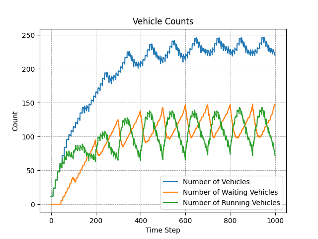
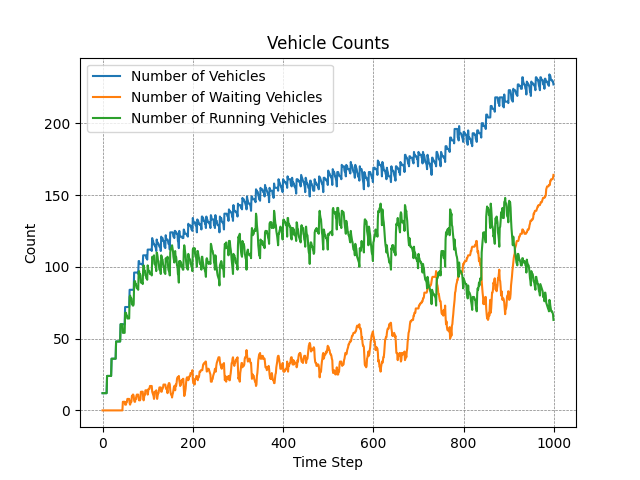

# Deep Reinforcement Learning Traffic Management

This project implements a Deep Reinforcement Learning (DRL)-based traffic management system using the **CityFlow** simulator, **OpenAI Gymnasium**, and **Stable Baselines3 PPO**. The goal is to dynamically control traffic signals to improve traffic flow in urban areas.

## Demonstration

Here's a sample of the trained agent in action:


## Results

Below are the results comparing the **Webster's Traditional Method** and the **Stable Baselines PPO Model**:

<p align="center">
  
  
</p>

### Analysis

The first graph represents the simulation results using **Webster's traditional method**, while the second graph shows results from the **Stable Baselines PPO model**.

- **Webster's Method** demonstrates stable behavior with consistent cyclic patterns. The total number of vehicles stabilizes between **220-250**, while the number of waiting vehicles follows a predictable oscillation pattern, peaking at around **130**. The number of running vehicles maintains a steady range between **80-100**, indicating stable but less optimized traffic management.

- **PPO Model** initially performs better with improved vehicle throughput and controlled waiting vehicle counts. The total number of vehicles remains similar, stabilizing near **220**. However, after around **600 time steps**, the PPO model shows instability. The number of waiting vehicles rises significantly, occasionally exceeding **150**, and the number of running vehicles fluctuates, dropping as low as **40-50** at certain points.

Overall, **Webster's method** offers reliable yet less efficient traffic control, while the **PPO model** shows potential for improved results but requires further tuning to achieve stability. Balancing performance improvements with stability will be key for the PPO model to consistently outperform the traditional method.

## Features

- Uses **CityFlow** as the simulation environment for realistic traffic scenarios.
- Implements a custom Gymnasium environment named `CityflowEnv` for seamless integration with Stable Baselines3 PPO.
- Handles multi-intersection data, dynamically managing traffic signal phases.
- Incorporates TensorBoard logging for detailed performance monitoring.

## Installation

1. Clone the repository:
   ```bash
   git clone https://github.com/Aavishkar-Kolte/deep-reinforcement-learning-traffic-management.git
   cd deep-reinforcement-learning-traffic-management
   ```
2. Install **CityFlow** by following the official installation guide:
   [CityFlow Installation](https://cityflow.readthedocs.io/en/latest/)

3. Install the required dependencies:
   ```bash
   pip install -r requirements.txt
   ```

## Usage

### Training the Model

To train the PPO model on the CityFlow environment, use the following command:

```bash
python train_ppo.py --env_name example --max_timesteps 200 --total_timesteps 100000
```

- `--env_name`: Specify the environment name (e.g., `example`).
- `--max_timesteps`: Set the maximum number of timesteps per episode.
- `--total_timesteps`: Define the total number of timesteps for training (default: `1000 * max_timesteps`).

### Generating Replay Files

After training, you can generate simulation replays and analyze performance metrics using:

```bash
python generate_model_simulation_replay.py
```

- This will generate replay files and charts showing key metrics like average travel time, average speed, and vehicle counts.
- Replay files are saved in the corresponding run directory inside `models/<env_name>/<run_number>`.

### Comparing Model Simulations

To compare multiple model simulations side by side, run:

```bash
python simulation_comparison.py --files <path_to_charts1> <path_to_charts2> --labels "Model 1" "Model 2"
```

- `--files`: Specify paths to the `charts.txt` files generated in each model's replay directory.
- `--labels`: Provide corresponding labels for each dataset to distinguish them in the comparison plots.

This comparison will generate combined charts showcasing differences in average travel time, speed, and vehicle counts across models.

## Future Improvements

- Introduce more complex intersections and road networks.
- Implement a better reward function.
- Explore alternative DRL algorithms.
